# Amusement Hub - Entity Relationship Diagram (ERD)

## Database Schema Overview

```mermaid
erDiagram
    %% Core Entities
    USERS {
        int id PK
        string email UK
        string username UK
        string password_hash
        string first_name
        string last_name
        string avatar_url
        string phone
        date date_of_birth
        enum role "user|admin|moderator"
        boolean is_verified
        boolean is_active
        timestamp created_at
        timestamp updated_at
        timestamp last_login
    }

    CATEGORIES {
        int id PK
        string name UK
        string slug UK
        string description
        string image_url
        int display_order
        boolean is_active
        timestamp created_at
        timestamp updated_at
    }

    LOCATIONS {
        int id PK
        int category_id FK
        string name UK
        string slug UK
        text description
        string address
        string city
        string state
        string country
        string postal_code
        decimal latitude
        decimal longitude
        string phone
        string website
        string email
        decimal average_rating
        int total_reviews
        int total_visitors
        boolean is_featured
        boolean is_active
        timestamp created_at
        timestamp updated_at
    }

    LOCATION_IMAGES {
        int id PK
        int location_id FK
        string image_url
        string alt_text
        int display_order
        boolean is_primary
        timestamp created_at
    }

    LOCATION_FEATURES {
        int id PK
        int location_id FK
        string feature_name
        string description
        string icon_url
        int display_order
        timestamp created_at
    }

    OPENING_HOURS {
        int id PK
        int location_id FK
        int day_of_week "0-6"
        time opening_time
        time closing_time
        boolean is_closed
        string special_notes
        timestamp created_at
        timestamp updated_at
    }

    TICKET_TYPES {
        int id PK
        int location_id FK
        string name
        string description
        decimal price
        string age_group "adult|child|senior|infant"
        int min_age
        int max_age
        boolean is_active
        timestamp created_at
        timestamp updated_at
    }

    SPECIAL_EVENTS {
        int id PK
        int location_id FK
        string event_name
        text description
        date start_date
        date end_date
        time start_time
        time end_time
        string event_type
        decimal additional_cost
        boolean is_active
        timestamp created_at
        timestamp updated_at
    }

    REVIEWS {
        int id PK
        int user_id FK
        int location_id FK
        int rating "1-5"
        text review_text
        boolean is_verified_visit
        boolean is_helpful
        int helpful_count
        boolean is_approved
        timestamp created_at
        timestamp updated_at
    }

    REVIEW_IMAGES {
        int id PK
        int review_id FK
        string image_url
        string caption
        timestamp created_at
    }

    USER_FAVORITES {
        int id PK
        int user_id FK
        int location_id FK
        timestamp created_at
    }

    USER_VISITS {
        int id PK
        int user_id FK
        int location_id FK
        date visit_date
        text visit_notes
        int rating
        timestamp created_at
    }

    BOOKINGS {
        int id PK
        int user_id FK
        int location_id FK
        string booking_reference UK
        date visit_date
        int adult_tickets
        int child_tickets
        int senior_tickets
        decimal total_amount
        enum status "pending|confirmed|cancelled|completed"
        string payment_method
        string payment_status
        timestamp created_at
        timestamp updated_at
    }

    BOOKING_TICKETS {
        int id PK
        int booking_id FK
        int ticket_type_id FK
        int quantity
        decimal unit_price
        decimal total_price
        timestamp created_at
    }

    LOCATION_STATS {
        int id PK
        int location_id FK
        date stat_date
        int daily_visitors
        decimal average_wait_time
        int total_rides_operational
        int total_rides_closed
        string weather_conditions
        timestamp created_at
    }

    RIDE_ATTRACTIONS {
        int id PK
        int location_id FK
        string ride_name
        text description
        string ride_type
        int min_height_cm
        int max_height_cm
        int min_age
        string thrill_level "low|medium|high|extreme"
        int capacity_per_hour
        int average_wait_time
        boolean is_operational
        timestamp created_at
        timestamp updated_at
    }

    RIDE_WAIT_TIMES {
        int id PK
        int ride_id FK
        int current_wait_time
        enum status "open|closed|maintenance"
        timestamp recorded_at
    }

    LOCATION_TAGS {
        int id PK
        string tag_name UK
        string tag_description
        timestamp created_at
    }

    LOCATION_TAG_ASSOCIATIONS {
        int id PK
        int location_id FK
        int tag_id FK
        timestamp created_at
    }

    %% Relationships
    USERS ||--o{ REVIEWS : "writes"
    USERS ||--o{ USER_FAVORITES : "has"
    USERS ||--o{ USER_VISITS : "visits"
    USERS ||--o{ BOOKINGS : "makes"

    CATEGORIES ||--o{ LOCATIONS : "contains"

    LOCATIONS ||--o{ LOCATION_IMAGES : "has"
    LOCATIONS ||--o{ LOCATION_FEATURES : "offers"
    LOCATIONS ||--o{ OPENING_HOURS : "operates"
    LOCATIONS ||--o{ TICKET_TYPES : "sells"
    LOCATIONS ||--o{ SPECIAL_EVENTS : "hosts"
    LOCATIONS ||--o{ REVIEWS : "receives"
    LOCATIONS ||--o{ USER_FAVORITES : "favorited_by"
    LOCATIONS ||--o{ USER_VISITS : "visited_by"
    LOCATIONS ||--o{ BOOKINGS : "booked_for"
    LOCATIONS ||--o{ LOCATION_STATS : "tracks"
    LOCATIONS ||--o{ RIDE_ATTRACTIONS : "has"
    LOCATIONS ||--o{ LOCATION_TAG_ASSOCIATIONS : "tagged_with"

    REVIEWS ||--o{ REVIEW_IMAGES : "includes"

    BOOKINGS ||--o{ BOOKING_TICKETS : "contains"

    RIDE_ATTRACTIONS ||--o{ RIDE_WAIT_TIMES : "tracks"

    LOCATION_TAGS ||--o{ LOCATION_TAG_ASSOCIATIONS : "assigned_to"
```



## Entity Descriptions

### Core Entities

#### 1. **USERS**
- **Purpose**: Store user account information
- **Key Features**: Authentication, profile management, role-based access
- **Relationships**: Reviews, Favorites, Visits, Bookings

#### 2. **CATEGORIES**
- **Purpose**: Organize locations by type (Theme Parks, Water Parks, etc.)
- **Key Features**: Hierarchical organization, display ordering
- **Relationships**: Locations (One-to-Many)

#### 3. **LOCATIONS**
- **Purpose**: Main amusement park/entertainment venue data
- **Key Features**: Geographic data, contact info, ratings, status
- **Relationships**: Multiple related entities (Images, Features, Hours, etc.)

### Supporting Entities

#### 4. **LOCATION_IMAGES**
- **Purpose**: Store multiple images per location
- **Key Features**: Primary image designation, display ordering

#### 5. **LOCATION_FEATURES**
- **Purpose**: List attractions and amenities
- **Key Features**: Categorized features with descriptions

#### 6. **OPENING_HOURS**
- **Purpose**: Store operating hours for each day
- **Key Features**: Special notes for holidays/closures

#### 7. **TICKET_TYPES**
- **Purpose**: Different ticket categories and pricing
- **Key Features**: Age-based pricing, seasonal rates

#### 8. **SPECIAL_EVENTS**
- **Purpose**: Track seasonal events, shows, promotions
- **Key Features**: Date ranges, additional costs

### User Interaction Entities

#### 9. **REVIEWS**
- **Purpose**: User-generated reviews and ratings
- **Key Features**: Verification, helpfulness voting, moderation

#### 10. **USER_FAVORITES**
- **Purpose**: Allow users to save favorite locations
- **Key Features**: Quick access to preferred venues

#### 11. **USER_VISITS**
- **Purpose**: Track user visit history
- **Key Features**: Personal visit notes, ratings

#### 12. **BOOKINGS**
- **Purpose**: Ticket booking system
- **Key Features**: Payment tracking, booking status

### Operational Entities

#### 13. **LOCATION_STATS**
- **Purpose**: Daily operational statistics
- **Key Features**: Visitor counts, wait times, weather

#### 14. **RIDE_ATTRACTIONS**
- **Purpose**: Individual ride/attraction details
- **Key Features**: Height/age restrictions, capacity, thrill levels

#### 15. **RIDE_WAIT_TIMES**
- **Purpose**: Real-time wait time tracking
- **Key Features**: Live updates, operational status

### Categorization Entities

#### 16. **LOCATION_TAGS**
- **Purpose**: Flexible tagging system
- **Key Features**: Custom categorization beyond main categories

## Key Design Decisions

### 1. **Normalization**
- Separated images, features, and hours into their own tables
- Allows for multiple entries per location
- Enables efficient querying and updates

### 2. **Flexibility**
- Tag system allows for custom categorization
- Multiple ticket types per location
- Extensible event system

### 3. **Scalability**
- Separate stats tracking for analytics
- Real-time wait time updates
- User interaction tracking

### 4. **Data Integrity**
- Foreign key constraints
- Unique constraints on slugs and emails
- Timestamp tracking for all entities

### 5. **Performance**
- Indexed foreign keys
- Separate tables for frequently updated data (wait times, stats)
- Efficient querying structure

## Indexes and Constraints

### Primary Keys
- All entities have auto-incrementing integer primary keys

### Unique Constraints
- User email and username
- Location and category slugs
- Booking reference numbers
- Tag names

### Foreign Key Constraints
- All relationships are properly constrained
- Cascade deletes where appropriate
- Referential integrity maintained

### Recommended Indexes
```sql
-- Performance indexes
CREATE INDEX idx_locations_category ON locations(category_id);
CREATE INDEX idx_locations_featured ON locations(is_featured, is_active);
CREATE INDEX idx_reviews_location ON reviews(location_id, created_at);
CREATE INDEX idx_bookings_user ON bookings(user_id, created_at);
CREATE INDEX idx_wait_times_ride ON ride_wait_times(ride_id, recorded_at);
```

This ERD provides a solid foundation for a dynamic amusement hub platform with room for growth and feature expansion. 